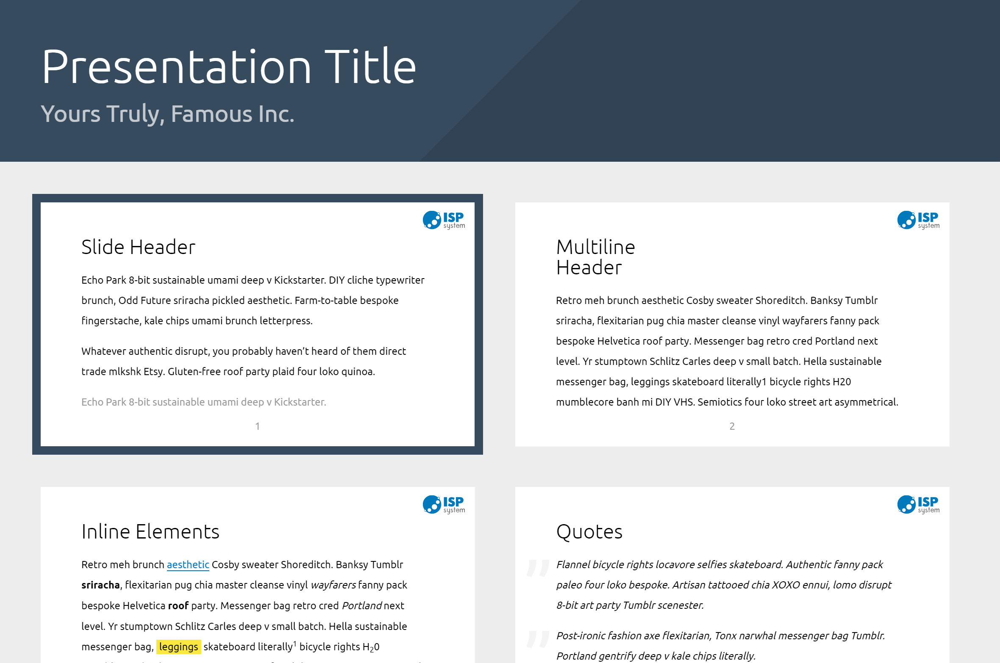

# ISPsystem Shower Theme

Theme for the [Shower](https://github.com/shower/shower/) presentation engine. Based on [Material theme](https://github.com/shower/material)

## Usage

	npm install 

	npm start

## Ratios

ISPsystem theme supports any slide ratio you want. But it’s optimized for the most common ones: 16×9 and 4×3. It’s 16×9 by default, but you can change it by adjusting `--slide-ratio` property for `.shower`, [see example](https://github.com/shower/ribbon/blob/master/index.html#L10) in `index.html`.

---
Licensed under [MIT License](LICENSE.md).
